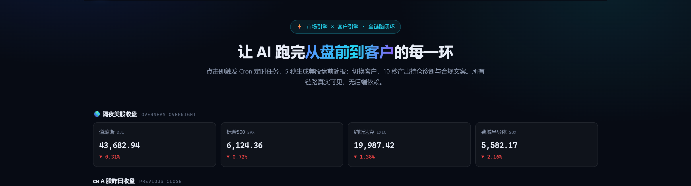
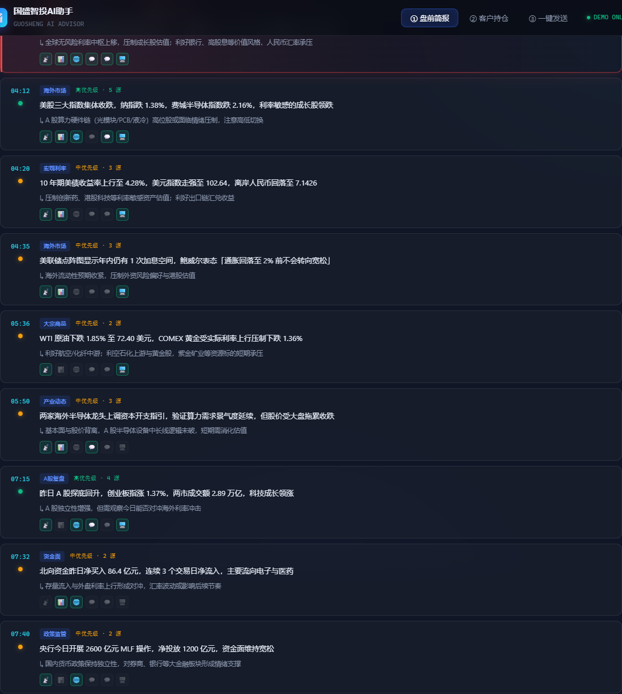
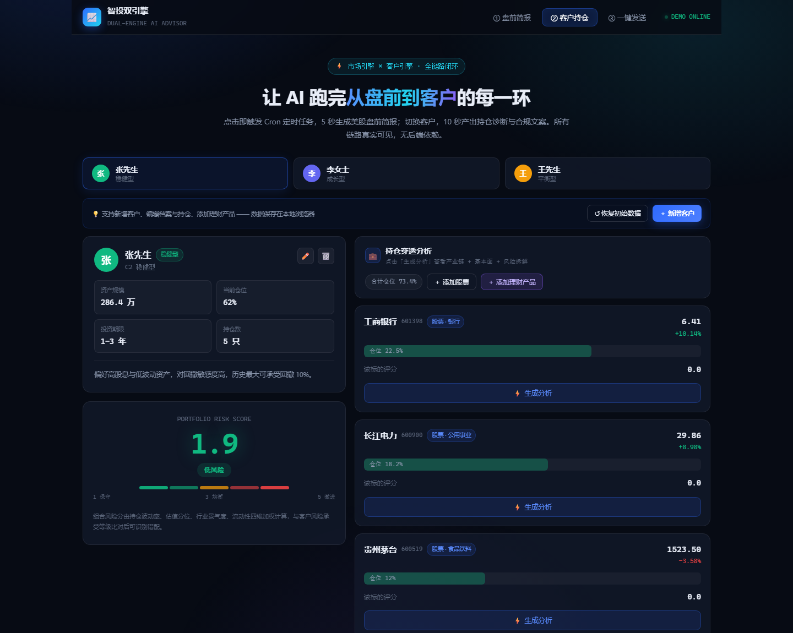
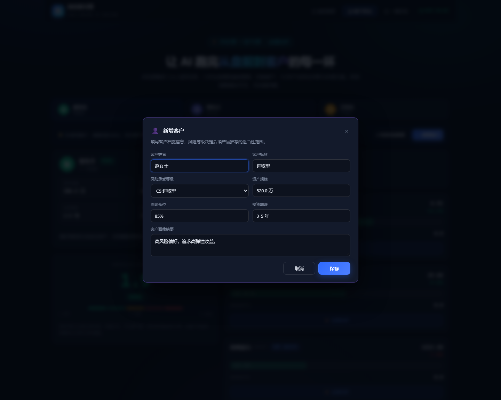
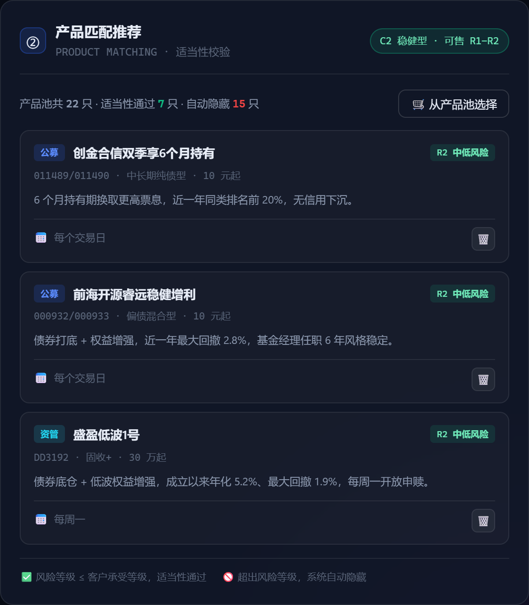
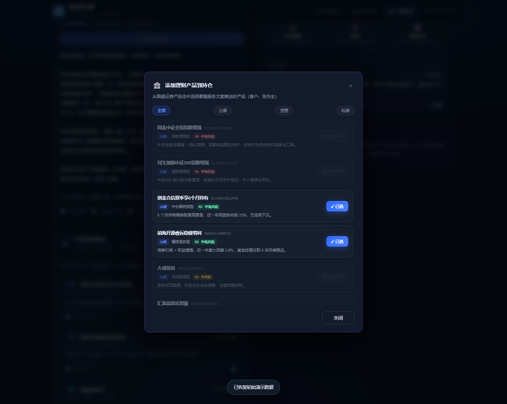
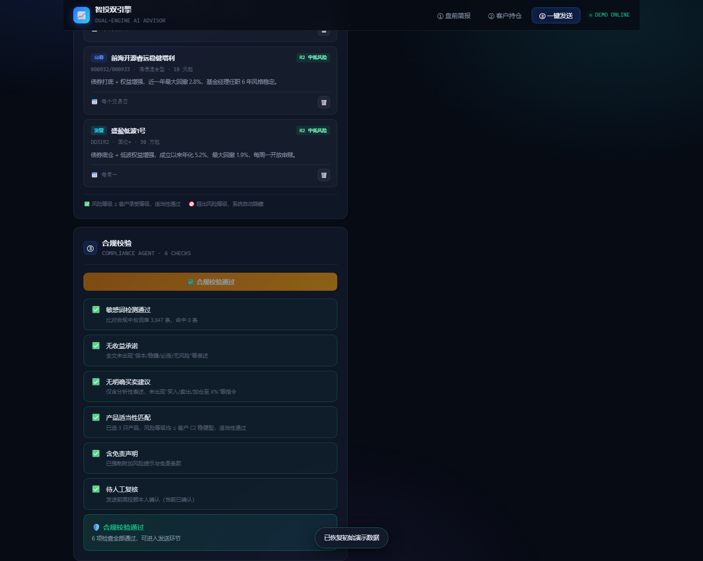

# 国盛智投AI助手 · Guosheng AI Advisor

> **从盘前到客户，AI 投顾全链路交互 Demo**
> 一个链接，点开就能玩。评委扫码自己点出来的效果，比讲 10 分钟更强。

[](https://gszqai.github.io/ai-advisor-demo/)
[](#对应比赛-poc)
[](#技术方案)

---

## 一句话价值主张

让评委点开一个链接，亲手触发 Cron，看着 AI 在 8 秒内聚合 6 路信源、产出可追溯的盘前简报；再点一下，为任意客户生成持仓诊断、按适当性匹配产品、一键发送合规文案。

**这不是演示，这是体验。**

### V2 升级（针对内部评审三条意见）

| 评审意见 | 落地内容 |
|---|---|
| ① 美股映射 A 股不够全面 | **三层市场输入**：隔夜美股 + **A 股昨日收盘（含创业板指、成交额）** + 关键变量（**新增北向资金**）；**6 路信源 × 9 条要闻的交叉验证聚合面板**（含 1 条最高优先级置顶）；简报升级为**五段式**，新增「信息来源统计」段 |
| ② 缺少理财产品、客户不可编辑 | 持仓纳入 **公募基金 / ETF / 资管产品 / 私募基金**；客户与持仓**全量 CRUD**（新增/编辑/删除），`localStorage` 持久化，一键恢复出厂 |
| ③ 不推产品 | **产品匹配推荐引擎**：国盛证券在售 **22 只真实产品库**（公募 9 / 资管 9 / 私募 4），按 `产品风险等级 ≤ 客户承受等级` **硬约束**匹配，超风险产品**置灰禁选**；**已选产品自动编入服务文案正文**（含代码/类型/风险等级/亮点），确保「文案里写的」和「实际推的」永远一致；合规校验 5 项 → **6 项** |
| ④ 演示真实性 | 全量数据取自**真实交易日口径**（9/17 收盘），各变量之间保持因果自洽 |

**销售系数（内部考核指标）仅用于推荐排序，前端完全不展示。**

### V3 升级（针对内部评审三条新意见）

| 评审意见 | 落地内容 |
|---|---|
| ① 简报逻辑过度依赖美国 | **信源权重重构为「国内 60% / 海外 40%」**：资讯池固定为 **国内 9 条 + 海外 6 条 = 15 条**，并做**真实国内时政选材**（LPR 报价持平 / DR007 低于政策利率、工信部"人工智能+软件"专项行动、半导体多层级扶持政策、中长期资金入市"长钱长投"、北向资金成交额）；简报首页即标注**信息来源权重：国内 60%（9 条）· 海外 40%（6 条）**，宏观变量条**国内优先排列**并带 🇨🇳/🌎 标记；**行情区第一行为 A 股、第二行为美股**，从版面上直接体现"A 股定价主导变量在国内" |
| ② 客户信息替换为真实数据 | 依据 **`客户数据.xls`（6 位真实客户 / 25 笔真实持仓）** 重建客户库：**安妮女士 / 刘宸先生 / 任嘉先生 / 谢昀先生 / 钱玥女士 / 高铭先生**，持仓标的、**真实盈亏率**、仓位、风险等级（C3–C5）、换手率、持仓风格、有无买过产品全部还原；**可编辑功能完整保留**（客户档案可编辑姓名/风险等级/资产规模/换手率/风格/买过产品，持仓可编辑盈亏率/仓位） |
| ③ 简报 × 持仓 × 产品三方融合推送 | 一键发送的文案升级为**三方融合**：**盘前简报要点（市场面）× 客户真实持仓诊断（持仓面）× 公司产品匹配（产品匹配）**，采用**「一、市场面 / 二、持仓面 / 三、配置建议 / 四、产品匹配」四段式**，产品段由「国盛证券产品池 + 适当性校验」自动生成；文案区顶部新增**「🧬 三方融合生成链路」来源面板**，直观展示简报/持仓/产品三路数据如何合成一段推送 |
| ④ 客户没时间读长文案 | 新增**「✂️ 投顾精炼」**：把 1000+ 字长文案压缩为 **100–200 字** 客户速读版，范式提炼自**18 张内部审核稿、约 180 条真实投顾观点**；按 `C1–C5` 差异化措辞、识别高集中度与轻仓特征、实时字数护栏、复用敏感词库自检；署名统一为**「国盛AI投顾老师」**；推送正文改为精炼稿，长文案转为报告附件留档 |

> **置顶项变更**：最高优先级置顶资讯为**国内「LPR 报价持平（1 年期 3.00% / 5 年期以上 3.50%）+ DR007 报 1.4512% 低于 1.50% 政策利率，流动性充裕」（6 渠道交叉验证）**，体现"国内定价主导"的简报逻辑。
>
> **隔夜数据的解读口径（V4）**：9/17 美股收盘呈**结构性分化** —— 道琼斯 -1.21%、标普500 -0.45%、纳斯达克 -0.01%（基本收平）、费城半导体 **+0.63%（主要指数中唯一上涨）**。叠加 10 年期美债收益率**回落**至 4.99%、离岸人民币偏强至 6.7041，外部流动性实际是边际改善的。因此简报的结论是「**情绪面压制权重与周期，对科技成长反而是相对正面的映射**」，而不是笼统的"美股跌→A 股全线承压"。这条因果链是本次数据更新的核心。A 股方面，9/17 四大指数同步小幅收跌（上证 -0.41% 报 3875.60）、两市成交约 1.82 万亿，**跌幅收敛 + 量能收缩 = 缩量观望而非集中抛售**。

---

## 对应比赛 POC

| 批次 | POC | 本项目的呈现 |
|---|---|---|
| 第一批 | **#1 盘前预测与市场解读** | 引擎一 · Tab1 盘前简报 |
| 第二批 | **#6 客户服务与一键发送** | 引擎二 · Tab2 持仓分析 + Tab3 一键发送 |

一个项目，两个 POC，一次拿满。

---

## 三大演示画面

### 画面一 · 盘前简报（引擎一）





**三层市场输入，不只映射美股。**

- **A 股昨日收盘（第一行）** —— 上证指数 / 深证成指 / **创业板指** / 科创 50，含两市成交额。**放在首行**，版面上先看国内
- **隔夜美股（第二行）** —— 道指 / 标普 / 纳指 / 费半 四张卡片。费半当日仅有涨跌幅、无收盘点位，卡片以 `—` 占位而非报错
- **关键变量** —— **国内优先**：1年期 LPR / 5年期以上 LPR / DR007 / 北向资金；海外：10Y 美债 / 离岸人民币 / 原油 / 黄金

**多源资讯聚合面板**：15 条隔夜要闻（**国内 9 条 · 60% / 海外 6 条 · 40%**），**最高优先级条目强制置顶**，其余按时间升序排列；每条标注信源命中情况与 **🇨🇳 国内 / 🌎 海外** 区域标签（信源含财联社电报 / 东方财富 Choice / 东方财富网 / 公众号·财联社 / 公众号·Choice数据 / Wind·iFinD / 国务院部委官网 / 交易所·证监会 / 统计局·央行 / 新华社·人民日报）。

```
多源交叉验证规则
  全渠道命中 → 🔴 最高优先级 · 重大宏观事件（置顶 + 红色高亮）
  ≥4 源命中  → 🟢 高优先级 · 确定性事件
  2-3 源命中 → 🟡 中优先级 · 待确认
  1 源命中   → ⚪ 低置信度 · 需人工复核
```

点「规则说明」可展开判定口径；点「📋 盘前简报 QA」可查看 13 道高频问答（按 合规 / 数据源 / 方法论 / 应用 四类筛选）。

点击「▶ 手动触发 Cron」，链路日志逐行滚动，状态灯依次点亮：

```
[08:00:00] ⏰ Cron 触发（交易日）
[08:00:01] 🔌 MCP 连接 Wind 行情服务...
[08:00:02] 📊 A 股：拉取上证 / 深证 / 创业板指 / 科创50 昨日收盘 ✅
[08:00:03] 📰 资讯：拉取财联社 / 东财 Choice / 东财网 全网要闻 82 条 ✅
[08:00:04] 🇨🇳 政策：拉取央行 / 国务院 / 发改委 / 工信部 官网原文 ✅
[08:00:05] 🔍 资讯：去重合并 → 15 条有效事件（国内 9 / 海外 6）✅
[08:00:06] 🎯 资讯：10 路信源交叉验证 → 最高优先级 1 / 高优先级 3 / 中优先级 5 ✅
[08:00:06] 🤖 Agent 载入投研 Prompt 模板（禁止买卖建议）...
[08:00:07] 🤖 Agent 载入投研 Prompt 模板（禁止买卖建议；国内信源权重 60%）...
[08:00:08] 🛡️ 合规审查：敏感词 0 命中 / 无收益承诺 / 已附免责声明 ✅
[08:00:09] 📤 推送企业微信「投顾晨会群」（触达 128 人）✅
```

随后简报以打字机效果逐字出现，严格遵循 **五段式结构**：盘前解读 → 信息来源统计 → 核心驱动链条 → A 股核心事件 → 趋势小结，且**以国内政策与流动性为第一驱动**。点「对比人工版本」可查看投顾老师的手写样例与效率对比数据。

### 画面二 · 客户持仓分析（引擎二）





六位内置客户（**源自真实客户数据 `客户数据.xls`**）可自由切换，**并支持随时新增、编辑、删除**：

| 客户 | 资产规模 | 换手率 | 持仓风格 | 风险等级 | 持仓构成 |
|---|---|---|---|---|---|
| 安妮女士 | 215 万 | 低 | 私募 | C5 进取型 | 2 只（均为私募基金） |
| 刘宸先生 | 232 万 | 低 | 大市值老登股 | C4 成长型 | 4 只（4 股票） |
| 任嘉先生 | 501 万 | 高 | 股债 | C4 成长型 | 4 只（3 股票 + 标准券） |
| 谢昀先生 | 133 万 | 高 | 科技 | C4 成长型 | 12 只（高集中度科技股） |
| 钱玥女士 | 30 万 | 中 | 基金和债 | C4 成长型 | 2 只（指数增强基金 + 标准券） |
| 高铭先生 | 23 万 | 中 | 股票集中度高 | C3 平衡型 | 1 只（单一标的 53.6%） |

**持仓可编辑（保留）**：

- 客户工具栏支持「编辑档案」（姓名 / 风险等级 / 资产规模 / 换手率 / 持仓风格 / 有无买过产品 / 备注）与「新增客户」
- 持仓栏支持「新增持仓」（手填代码 / 名称 / 类型 / 行业 / 权重 / **盈亏率** / 风险分）与悬停编辑 / 删除
- **真实盈亏率**驱动持仓卡与组合诊断（谢昀先生含 *ST闻泰、退市标的联络3 等真实风险样本）
- 支持从 22 只 **国盛证券真实产品池** 中一键加入持仓（公募 / 资管 / 私募）
- 全部改动写入 `localStorage`，刷新不丢；「恢复初始数据」一键回到出厂状态

每只标的点「生成分析」，依次输出：

- **产业链位置** —— 打字机逐字呈现，说明该标的在产业链中的具体卡位
- **基本面亮点** —— 结合最新经营数据的关键变化
- **风险因子拆解** —— 波动率 / 估值分位 / 行业景气 / 流动性 四维条形图
- **个股风险打分** —— ⭐ 逐颗点亮，1-5 分
- **组合风险分** —— 数字从 0 滚动到目标值，颜色分级：1-2 绿 / 3 黄 / 4-5 红

> 手填持仓若无分析师因子数据，会自动降级生成一组合理因子，分析流程不中断。

### 画面三 · 一键发送 + 产品匹配 + 合规护城河（引擎二）





**流程升级为五步：① 生成文案 → ② 投顾精炼 → ③ 产品匹配 → ④ 合规校验 → ⑤ 送达回执。**

**三方融合推送（V3 新增）**：生成的服务文案不是单一来源，而是**盘前简报 × 客户持仓 × 公司产品**三路数据的合成结果：

```
🧬 三方融合生成链路
  📡 盘前简报 (15 条资讯 · 国内 9 / 海外 6)
       ＋
  💼 客户持仓 (N 只 · 风险分 · 组合盈亏)
       ＋
  🏦 公司产品 (M 只 · 适当性已校验)
       ↓
   📨 推送文案（四段式：市场面 / 持仓面 / 配置建议 / 产品匹配）
```

文案正文严格按 **「一、市场面 · 盘前简报要点 / 二、持仓面 · 组合诊断 / 三、配置建议 / 四、产品匹配 · 结合您的持仓结构筛选」** 四段生成；切换客户时，署名、持仓诊断、匹配产品**同步变化且互不串数据**；每次生成前的融合面板都会标注三路来源与本次附带的产品数量，便于投顾核验。

**✂️ 投顾精炼（V4 新增）**：真实业务里，客户没有时间读 1000+ 字的长文案。精炼 Agent 把长文案压缩为 **100–200 字** 的投顾口吻速读稿，**客户 10 秒读完即知该做什么**。

压缩范式来自 **18 张内部审核稿、约 180 条真实投顾盘前/盘后观点**，提炼为「五段式」：

```
① 开篇定调  → 一句话概括隔夜海外市场（约 20 字）
② 盘面归因  → 指数/成交额/领涨领跌板块/情绪（约 40 字）
③ 持仓定性  → 组合盈亏方向 + 集中度/仓位提示（约 40 字）
④ 配置建议  → 按 C1–C5 风险等级差异化的方向性建议（约 40 字）
⑤ 合规收尾  → 免责声明（约 25 字）
```

设计要点：

- **署名统一为「国盛AI投顾老师」**，不出现任何投顾真名
- **实时字数护栏**：字数徽标落在 100–200 区间内标绿、越界标橙；超限自动丢弃次要补充句，未达下限自动补足板块归因，保证「话说完整」
- **生成即自检**：精炼稿复用全局敏感词库（`SENSITIVE_WORDS`，16 条）自动复核，确保压缩过程不引入「稳赚/保本/必涨」类违规表述
- **一键复制**：自动带上交易日期与署名，可直接粘贴给客户
- **推送正文以精炼稿为准**，长文案作为「持仓分析报告」附件留档；送达回执分别记录「推送正文」与「随附附件」，投顾可追溯

**产品匹配推荐引擎（新增）**：选中客户后，系统按适当性原则自动匹配产品。

```
可售判定：product.riskLevel <= client.riskLevel
高铭先生 C3 平衡型 → 可售 R1-R3（超 R3 产品自动隐藏）
刘宸先生 / 任嘉先生 / 谢昀先生 / 钱玥女士 C4 成长型 → 可售 R1-R4
安妮女士 C5 进取型 → 可售 R1-R5（全产品池）
```

- 自动推荐 3 只（跨 公募 / 资管 / 私募 三类分散，优先销售系数高者）
- 超风险产品在选品弹窗中**置灰禁选**，并标注拦截原因
- 支持按产品类别筛选（全部 / 公募 / 资管 / 私募）
- 送达回执中显式列出「附带产品」清单，可追溯

**产品库**：国盛证券 818 理财节在售产品 22 只 —— 9 只公募 + 9 只资管 + 4 只私募，含产品简称、代码、风险等级、投资子类、起投门槛、开放日、卖点说明。

> 销售系数（内部考核指标）仅用于推荐排序，**前端完全不展示**。

随后合规校验逐条打勾（6 项，新增「产品适当性匹配」）→ 选择渠道（企微 / 短信 / APP）→ 手机模型动画消息飞入 → 送达回执。

**彩蛋：合规拦截**



点「🎯 试试合规拦截」，输入含「稳赚」的文案，触发拦截并标注违反的具体法规条款。这是真实生产环境的强合规闸门演示。

---

## 技术方案

| 层 | 选型 | 理由 |
|---|---|---|
| 前端 | 纯 HTML + CSS + 原生 JS | 零构建、零依赖、双击即开 |
| 数据 | `data.js` 静态 Mock | 100% 可控，无接口失败风险 |
| 逻辑 | `app.js` 剧本控制 | 打字机、日志流、动画编排 |
| 部署 | GitHub Pages | 免费、稳定、联网即开 |

**无后端、无构建步骤、无外部 CDN 依赖** —— 断网也能本地打开。

### 项目结构

```
ai-advisor-demo/
├── index.html          # 单页 3 Tab 结构
├── data.js             # Mock 数据层（行情/资讯/QA/6 位真实客户/22 只产品库/敏感词库/文案模板/投顾精炼知识库）
├── app.js              # 交互剧本引擎 + 客户/持仓 CRUD + 产品匹配引擎 + 三方融合文案生成 + 投顾精炼引擎
├── style.css           # 浅色简约主题样式（白底、卡片化排版）
├── assets/             # 截图资源
│   ├── v2-1-market.png         # 三层市场数据
│   ├── v2-2-news.png           # 多源资讯聚合
│   ├── v2-3-brief.png          # 五段式简报输出
│   ├── v2-4-client.png         # 客户持仓（可编辑）
│   ├── v2-5-client-modal.png   # 新增/编辑客户
│   ├── v2-6-product-pool.png   # 产品池（C5 全可选）
│   ├── v2-7-product-match.png  # 产品匹配推荐
│   ├── v2-8-suability.png      # 适当性拦截
│   ├── v2-9-compliance.png     # 合规校验
│   ├── v2-10-receipt.png       # 送达回执
│   └── v2-11-mobile.png        # 移动端
├── PRESENTATION.md     # 5 分钟现场演示脚本
├── QA.md               # 答辩 Q&A 预案
└── README.md
```

### 数据层速览

| 常量 | 内容 |
|---|---|
| `US_MARKET` / `CN_MARKET` | 隔夜美股 4 指数 + A 股 4 指数 |
| `MACRO` | 关键变量 10 项（**国内 5 项优先 + 海外 5 项**，各带 `region` 标记） |
| `NEWS_CHANNELS` / `NEWS` | **10 路信源 + 15 条聚合要闻（国内 9 / 海外 6 = 60% / 40%，含 1 条 `top: true` 置顶项）** |
| `NEWS_REGION_RATIO` | **国内外信源配比常量（cn 60 / us 40）** |
| `BRIEF_AI` | 国内主导的盘前简报正文（首行标注信源权重） |
| `BRIEF_MARKET_SUMMARY` | **简报要点精简版（供三方融合文案复用）** |
| `BRIEF_QA` | 盘前简报 QA（含国内政策专题） |
| `CLIENTS` | **6 位真实客户 + 25 条真实持仓（含真实盈亏率 pnl 字段）** |
| `COPY_TEMPLATES` | **6 位客户的精写文案模板（四段式、以盘前简报开篇）** |
| `REFINE_KB` | **投顾精炼知识库（五段式压缩范式、C1–C5 差异化建议、100–200 字护栏、统一署名）** |
| `PRODUCTS` | 国盛证券在售产品 22 只（公募 9 / 资管 9 / 私募 4） |
| `RISK_LEVEL_MAP` | C1-C5 ↔ R1-R5 适当性映射 |
| `COMPLIANCE_RULES` | 合规校验 6 项 |
| `SENSITIVE_WORDS` | 敏感词库 16 条 |
| `CRON_LOGS` | Cron 链路日志（含国内政策原文拉取） |

### 关键技术点

**① 打字机效果** —— 长文本自动提速（`>600` 字符时每次 2 字符），并渲染闪烁光标：

```js
function typewriter(el, text, speed = 18, clear = true) {
  return new Promise((resolve) => {
    if (clear) el.textContent = '';
    el.classList.add('typing');
    let i = 0;
    const timer = setInterval(() => {
      const step = text.length > 600 ? 2 : 1;
      el.textContent += text.slice(i, i + step);
      i += step;
      if (i >= text.length) { clearInterval(timer); el.classList.remove('typing'); resolve(); }
    }, speed);
  });
}
```

**② 日志滚动** —— 按真实时间戳节奏逐行追加，并联动点亮状态灯：

```js
async function runLogs(container, logs, onStep) {
  container.innerHTML = '';
  for (let i = 0; i < logs.length; i++) {
    await sleep(i === 0 ? 180 : 620);
    const line = document.createElement('div');
    line.className = 'log-line log-in';
    line.innerHTML = `<span class="log-time">[${logs[i].t}]</span>
                      <span class="log-icon">${logs[i].icon}</span>
                      <span class="log-text">${logs[i].text}</span>`;
    container.appendChild(line);
    container.scrollTop = container.scrollHeight;
    if (onStep) onStep(logs[i], i);
  }
}
```

**③ 风险打分动画** —— `easeOutCubic` 缓动，观感比线性插值自然得多：

```js
function animateNumber(el, target, { duration = 900, decimals = 1 } = {}) {
  return new Promise((resolve) => {
    const start = performance.now();
    function frame(now) {
      const p = Math.min((now - start) / duration, 1);
      const eased = 1 - Math.pow(1 - p, 3);
      el.textContent = (target * eased).toFixed(decimals);
      if (p < 1) requestAnimationFrame(frame);
      else { el.textContent = target.toFixed(decimals); resolve(); }
    }
    requestAnimationFrame(frame);
  });
}
```

**④ 合规敏感词检测** —— 与生产环境同一套判定逻辑：

```js
const hits = DATA.SENSITIVE_WORDS.filter((w) => text.includes(w.word));
if (hits.length) { /* 阻断下发 + 回退人工复核队列 */ }
```

---

## 本地运行

无需安装任何依赖，三种方式任选：

```bash
# 方式一：直接双击 index.html

# 方式二：起一个静态服务（推荐，避免浏览器 file:// 限制）
python -m http.server 8899
# 然后访问 http://127.0.0.1:8899

# 方式三：Node
npx serve .
```

### 快捷键

| 按键 | 作用 |
|---|---|
| `1` / `2` / `3` | 切换三个 Tab |
| `?tab=send` | URL 参数直接定位到指定 Tab |

---

## 部署到 GitHub Pages

```bash
cd ai-advisor-demo
git init
git add .
git commit -m "feat: 国盛智投AI助手 AI 投顾全链路 Demo"
git branch -M main
git remote add origin https://github.com/gszqai/ai-advisor-demo.git
git push -u origin main
```

然后：仓库 → **Settings** → **Pages** → Source 选 `main` / `root` → 保存。

约 1 分钟后访问：`https://gszqai.github.io/ai-advisor-demo/`

> **现场演示建议**：把这个链接生成二维码，投屏时直接让评委扫码。评委自己点出来的效果，比你讲 10 倍。

---

## 合规护城河

| 风险 | 我们的应对 |
|---|---|
| AI 荐股 | Prompt 层禁止买卖建议，输出只有分析；`COMPLIANCE_RULES` 显式校验 |
| **适当性错配** | **推荐引擎强制 `产品风险等级 ≤ 客户承受等级`，超风险产品置灰禁选并可追溯** |
| **资讯以假乱真** | **多源交叉验证：全渠道命中判最高优先级并置顶 / ≥4 源高优先级 / 2-3 源中优先级 / 1 源低置信度标记待复核** |
| 数据合规 | 生产环境 MCP 走公司内部源，Demo 全部使用 Mock 数据 |
| 客户隐私 | 模拟客户，真实场景脱敏 + 授权；发送前信息加密。**新增客户数据仅存本地 `localStorage`，不上传任何服务器** |
| 人工复核 | 所有输出需投顾确认才进入下发通道 |
| 免责声明 | 所有文案强制含「市场有风险，投资需谨慎」 |
| 敏感词 | 内置 16 条敏感词库，命中即阻断，彩蛋现场演示 |
| **内部指标外泄** | **销售系数仅用于推荐排序，前端零展示** |

---

## 核心差异化

| 维度 | 常规队伍 | 我们 |
|---|---|---|
| 演示 | 本地跑 / 录屏 | **联网即开，评委可玩** |
| 覆盖 | 单 POC | **双 POC 闭环** |
| 合规 | 提一句 | **内嵌 + 彩蛋演示** |
| 技术 | 调 API | **Cron + MCP + Agent + 前端全栈** |
| 商业 | 概念 | **投顾运营岗真实提效** |
| 传播 | 现场 | **链接可发群 / 简历** |

### 三个「别人做不到」

1. **别人做单点，我们做全链路。** 市场端到客户端，一气呵成。
2. **别人演示，我们体验。** 评委扫码自己玩，参与感拉满。
3. **别人提合规，我们演合规。** 敏感词拦截彩蛋，直接封神。

---

## 一句话收尾

> 我们不是做了一个 Demo，我们做了一个可以发给任何人、任何人点开就能体验的 AI 投顾产品。
